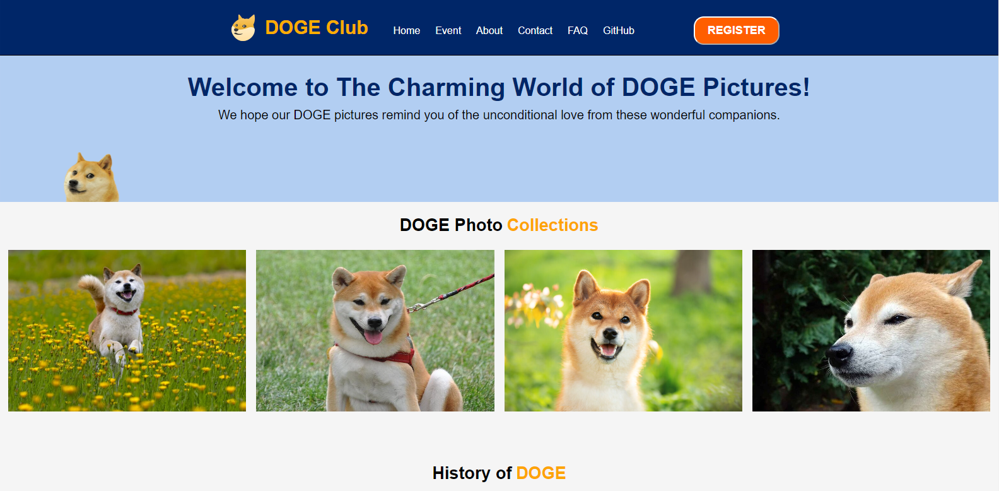

# Introduction

Hi I am Fahri, a Software Engineering Student in Revou batch June 2023 and welcome to my project repository!

Feel free to connect with me: 

  

## Description

This repo consists of an HTML file, CSS file, and JavaScript file for Week 2 Assignment Project.

    

## Files and Directory Structure

The repository includes the following files and directories:

- **index.html**: This file serves as the main entry point of the web application. It contains the structure and content of the web page, including HTML elements, layout, and content.
- **styles.css**: This CSS file contains the styles and visual design for the web page. It defines the colors, fonts, layout, and other visual aspects of the project.
- **script.js**: The JavaScript file includes function for scrolling and hidding content.
- **images/**: This directory contains any images or graphics used in the project. It is organized to store and reference image files for a more structured file management approach.

## Usage
To use this project, follow these steps:

1. Clone or download the repository to your local machine.
2. Open the index.html file in a web browser to view the web application.
3. Customize the HTML, CSS, and JavaScript files as needed to tailor the project to your specific requirements.
4. Add or replace images in the images/ directory if necessary.

## Live Demo

[Live Demo Link](https://project-doge.netlify.app/)

